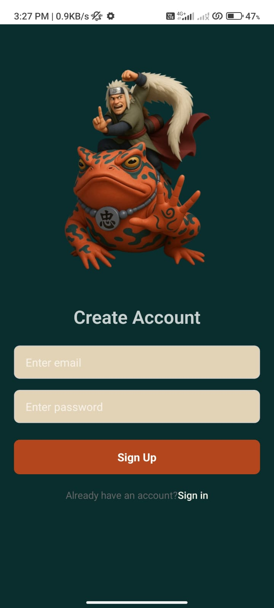
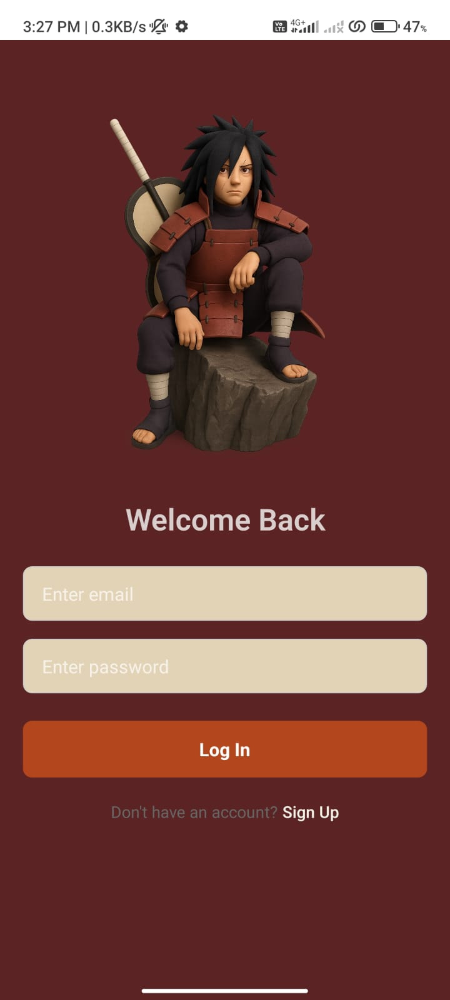
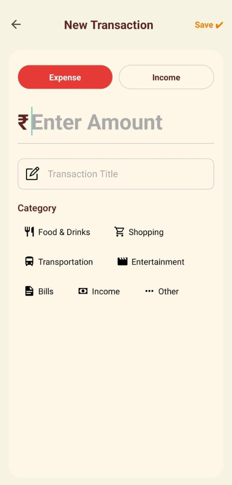
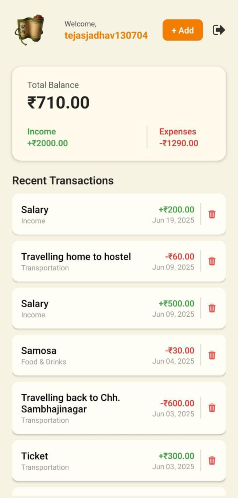
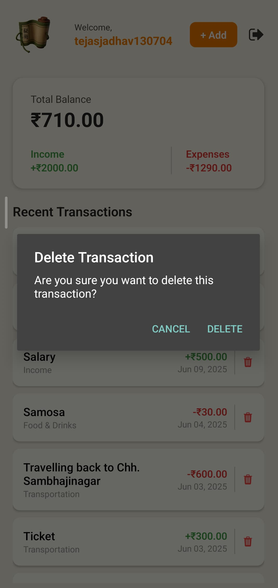
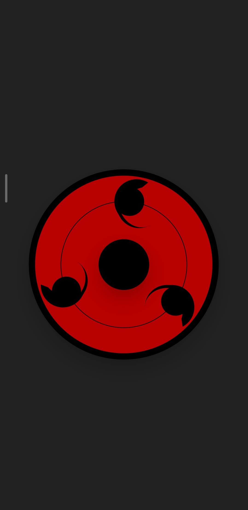
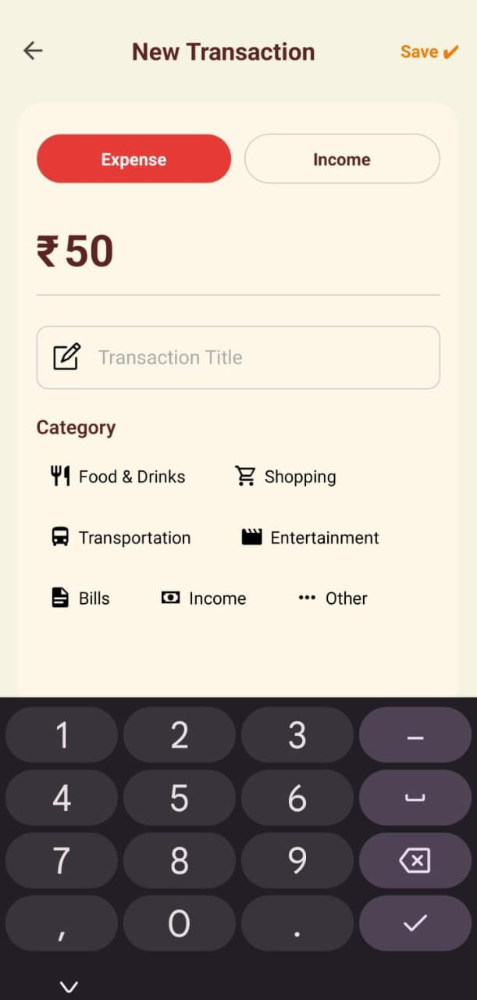
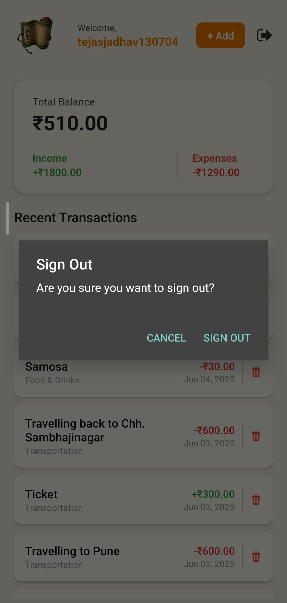

# 💸 Naruto-Themed Expense Tracker App

A visually striking, anime-themed expense tracker app built with **React Native (Expo)** for mobile frontend, **Express.js** for backend APIs, and **Firebase Authentication** for secure user login.

Inspired by the aesthetics of *Naruto*, this app turns daily expense management into a shinobi-worthy experience!

---

## 📂 Project Structure

```bash
.
├── backend          # Express.js backend for API
└── mobile           # React Native frontend (Expo)
````

---

## 📱 Screenshots

<div align="center">
  
  
  
  
</div>


<div align="center">
  
  
  
  
</div>


---

## 🔧 Features

* 🔥 **Firebase Authentication** (Email/Password)
* 📊 Add, view, and manage income & expenses
* 🧾 Categorized transactions (Food, Travel, Bills, etc.)
* 👨‍🎤 Anime-themed UI with characters like Jiraiya, Madara, etc.
* 📡 Backend API using **Express.js**
* ⚙️ RESTful APIs for transaction management
* 🎯 State managed using React Hooks

---

## 🚀 Getting Started

### 1. Clone the Repository

```bash
git clone https://github.com/tejas-130704/ExpenseTrackerApp.git
cd ExpenseTrackerApp
```

### 2. Setup Backend

```bash
cd backend
npm install
```

Now create a `.env` file in the `backend` folder and add the following:

```env
PORT=5000
DATABASE_URL=YOUR_NEONDB_LINK
```

Then start the server:

```bash
node index.js
# or
npm run dev
```

---

### 3. Setup Frontend (Expo)

```bash
cd ../mobile
npm install
npx expo start
```

Now create a file named `firebaseConfig.js` in the `mobile` folder and add your Firebase config like this:

```js
// mobile/firebaseConfig.js
export const firebaseConfig = {
  apiKey: "YOUR_API_KEY",
  authDomain: "YOUR_AUTH_DOMAIN",
  projectId: "YOUR_PROJECT_ID",
  storageBucket: "YOUR_STORAGE_BUCKET",
  messagingSenderId: "YOUR_MESSAGING_SENDER_ID",
  appId: "YOUR_APP_ID",
};
```

> Replace all values with your actual Firebase project credentials.

---

## 🛠️ Tech Stack

### Frontend

* React Native + Expo
* Firebase Auth
* Anime Character UI

### Backend

* Node.js + Express
* NeonDB (PostgreSQL)

---

## 🤝 Contributing

Pull requests are welcome. Feel free to open issues and suggest anime enhancements! 🍜

---

## ✨ Made with ❤️ by [Tejas Jadhav](https://tejas-130704.github.io/my-portfolio/)

